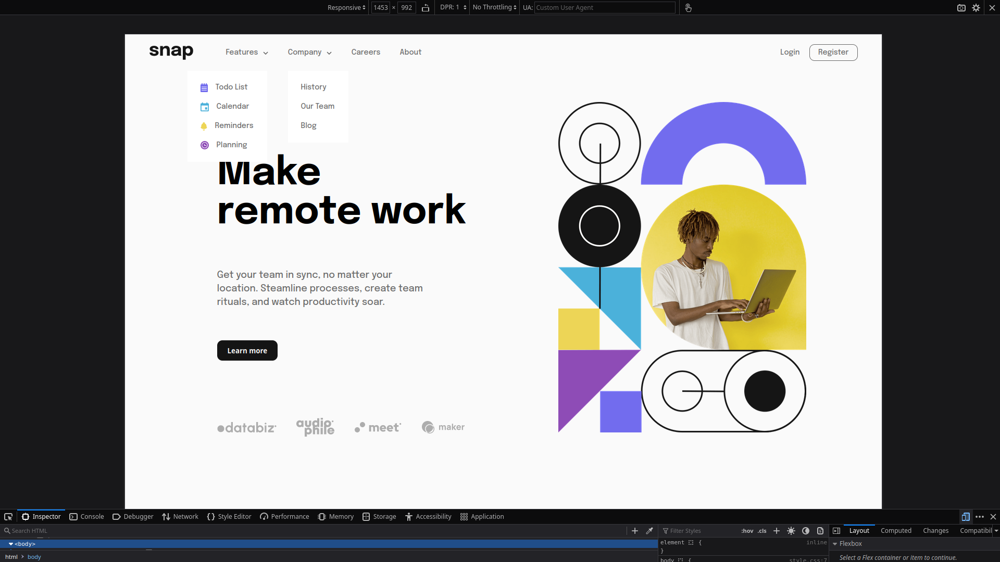
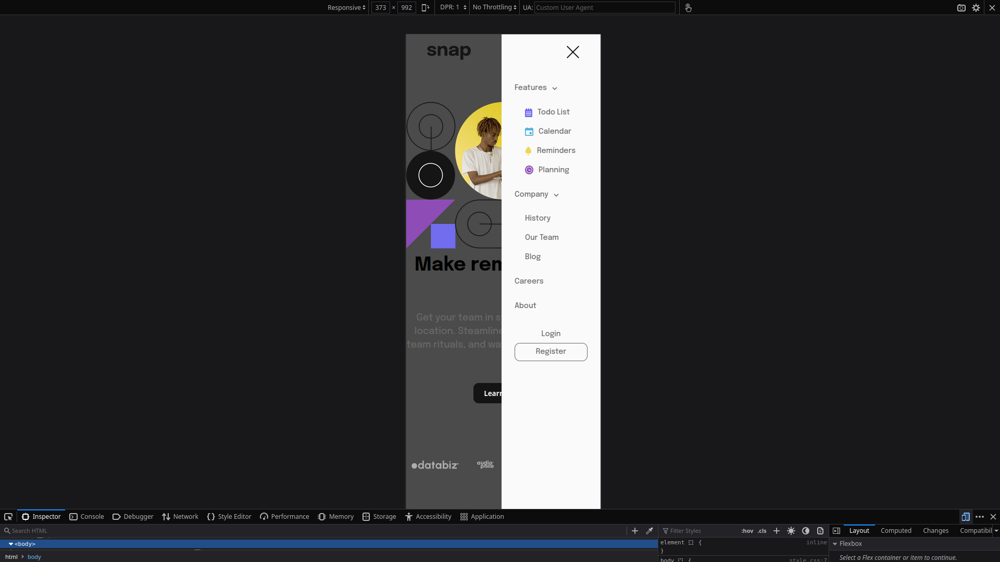

# Frontend Mentor - Intro section with dropdown menu navigation challenge

This is a solution to the [Intro section with dropdown menu navigation
 Challenge on Frontend Mentor](https://www.frontendmentor.io/challenges/intro-section-with-dropdown-navigation-ryaPetHE5).

## Table of contents

- [Overview](#overview)
  - [The challenge](#the-challenge)
  - [Screenshot](#screenshot)
  - [Links](#links)
- [My process](#my-process)
  - [Built with](#built-with)
  - [What I learned](#what-i-learned)
  - [Continued development](#continued-development)
  - [Useful resources](#useful-resources)
- [Author's Links](#authors-links)

## Overview

### The challenge
complete the challenge ^_^ 

### Screenshot

### Links

- Live Site URL: [https://callensj.github.io/intro-section-dropdown/](https://callensj.github.io/intro-section-dropdown/)

## My process

### Built with

-CSS(scss)
-Vanilla js

### What I learned
This project was interesting this was my first multi dropdown menu. I'm happy with my solution but still i can still not figure out how to rotate the arrows. cant select them all in one time. 

I also used node-sass in this project.
-npm install
-npm start

### Useful resources

## Author's Links

- Frontend Mentor - [@CallensJ](https://www.frontendmentor.io/profile/CallensJ)